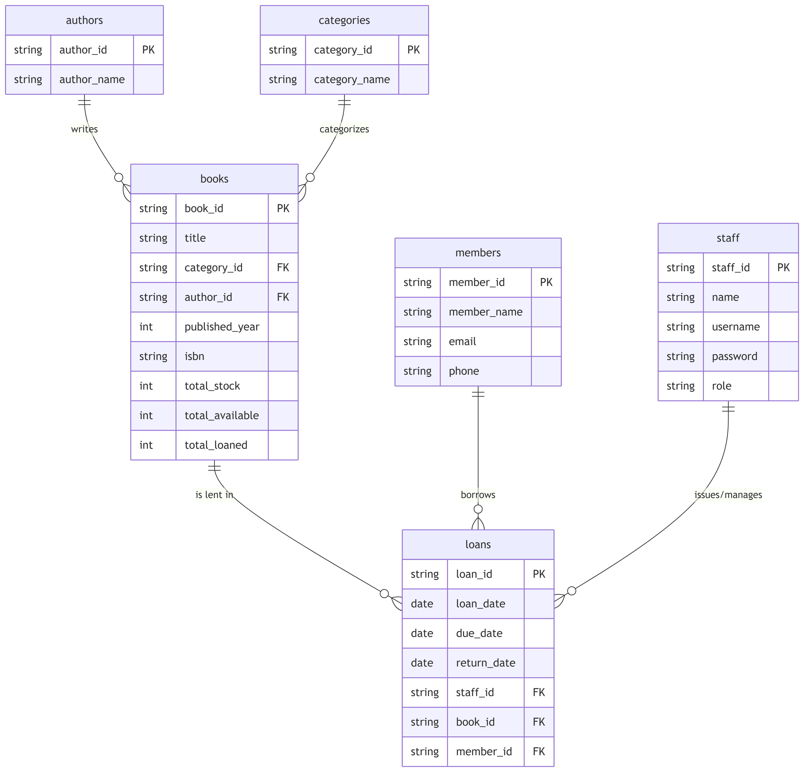

# Library Management System

A minimalistic, fully functional Library Management System built with Flask and SQLAlchemy.

## Features

- **Staff Authentication**: Secure login system with password hashing.
- **Inventory Management**: Track books, authors, and categories.
- **Member Management**: Manage member records and view their borrowing history.
- **Loan System**: Issue and return books with automatic inventory updates.
- **Search & Filtering**: Search books by title/ISBN and members by name/email.
- **Reports**: View active loans and overdue books (via SQL Views).
- **Responsive UI**: Minimalist design with light/dark mode support.

## Tech Stack

- **Backend**: Python, Flask, SQLAlchemy (SQLite)
- **Frontend**: HTML5, CSS3 (Vanilla), Jinja2

## Installation

1. **Clone the repository**:
   ```bash
   git clone <repository-url>
   cd Ahnf
   ```

2. **Create a virtual environment (optional but recommended)**:
   ```bash
   python -m venv venv
   source venv/bin/activate  # On Windows: venv\Scripts\activate
   ```

3. **Install dependencies**:
   ```bash
   pip install -r py/requirements.txt
   ```

## Running the Application

1. **Start the server**:
   ```bash
   python py/app.py
   ```

2. **Access the app**:
   Open your browser and navigate to `http://127.0.0.1:5000`.

## Default Credentials

The system comes with a pre-seeded admin account for initial setup:

| Username | Password   |
| -------- | ---------- |
| `admin`  | `admin123` |

## Project Structure

- `py/`: Python code directory.
- `py/app.py`: Main Flask application entry point.
- `py/models.py`: Database models.
- `py/routes.py`: Flask routes and views.
- `py/extensions.py`: Flask extensions.
- `py/fill.py`: Database seeder.
- `Commons/`: Shared frontend assets (`base.css`, `base.html`).
- `templates/`: Page-specific HTML templates used to render the UI.
- `py/library.db`: SQLite database (generated on first run).

ER diagram: 


Flowchart: 
